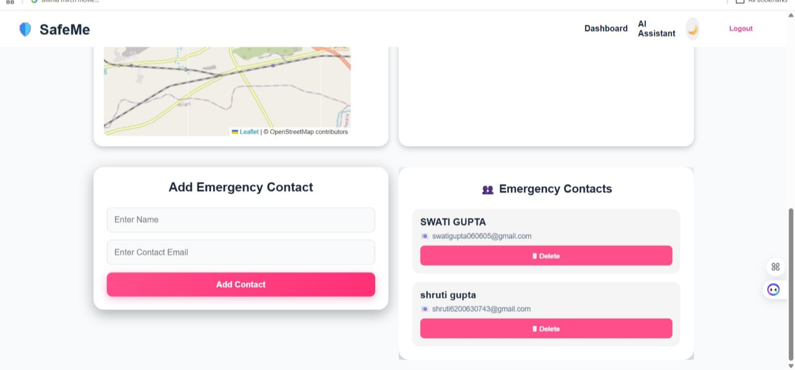
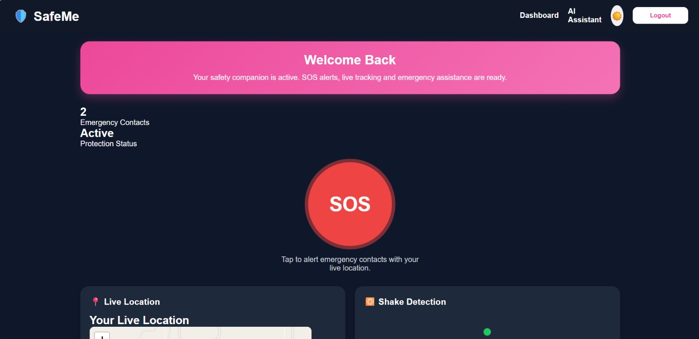

# 🛡️ SaveMe – Safety Web Application

> A full-stack MERN application designed to improve people safety by providing instant emergency assistance, real-time location sharing, and AI-powered support.

---

## 📌 Overview

SaveHer is a women safety platform that enables users to quickly alert trusted contacts during emergencies. It includes features like live location tracking, emergency contacts, push notifications, shake detection, and an AI Safety Assistant.

---

## ✨ Features

- 🚨 One-click SOS Button
- 📍 Real-Time Live Location Sharing
- 👥 Emergency Contact Management
- 📳 Shake Detection to Trigger SOS
- 🔔 Push Notifications
- 🤖 AI Safety Assistant
- 🔐 Secure User Authentication
- 📱 Responsive User Interface

---

## 🛠️ Tech Stack

### Frontend
- React.js
- JavaScript
- HTML5
- CSS3
- Axios

### Backend
- Node.js
- Express.js

### Database
- MongoDB
- Mongoose

### APIs & Services
- Google Maps API
- Firebase Cloud Messaging (FCM)

---

## 📂 Project Structure

```
SaveHer/
│
├── client/          # React Frontend
├── server/          # Express Backend
├── package.json
└── README.md
```

---

## 🚀 Getting Started

### Clone the Repository

```bash
git clone https://github.com/swati99gup/SaveHer.git
```

### Install Dependencies

#### Backend

```bash
cd server
npm install
npm start
```

#### Frontend

```bash
cd client
npm install
npm run dev
```

---

## 🎯 Future Enhancements

- 📞 Emergency Calling
- 💬 WhatsApp & SMS Alerts
- 🎤 Voice-Activated SOS
- 🚓 Nearby Police & Hospital Locator
- 👨‍👩‍👧 Guardian Live Tracking

---

## 📸 Screenshots

### Contact Page


### Dashboard


### SOS Feature

Example:

```
screenshots/
contact.jpeg
live-location.jpeg
sos.jpeg
```

---

## 🤝 Contributing

Contributions are welcome!

1. Fork the repository
2. Create a new branch

```bash
git checkout -b feature-name
```

3. Commit your changes

```bash
git commit -m "Add new feature"
```

4. Push to GitHub

```bash
git push origin feature-name
```

5. Open a Pull Request

---

## 👩‍💻 Author

**Swati Gupta**

- GitHub: https://github.com/swati99gup

---

⭐ If you found this project helpful, don't forget to star the repository!

